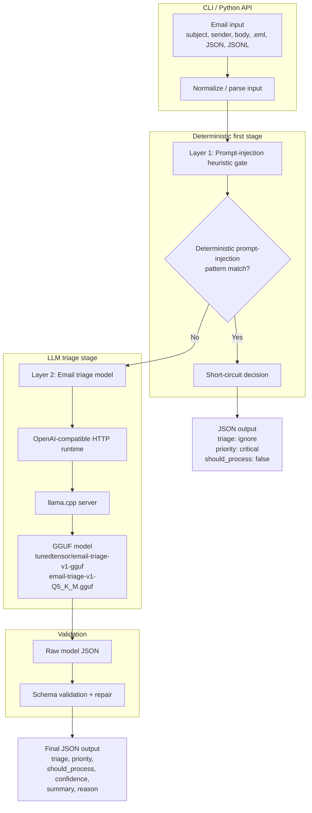

# Current Design

This page keeps the Mermaid runtime diagram out of the PyPI README while still
rendering nicely on GitHub.

```mermaid
flowchart TD
    A["Email input<br/>subject, sender, body, .eml, JSON, JSONL"] --> B["Normalize / parse input"]

    B --> C["Layer 1: Prompt-injection heuristic gate"]
    C --> D{"Deterministic prompt-injection<br/>pattern match?"}

    D -- "Yes" --> E["Short-circuit decision"]
    E --> F["JSON output<br/>triage: ignore<br/>priority: critical<br/>should_process: false"]

    D -- "No" --> G["Layer 2: Email triage model"]
    G --> H["OpenAI-compatible HTTP runtime"]
    H --> I["llama.cpp server"]
    I --> J["GGUF model<br/>tunedtensor/email-triage-v1-gguf<br/>email-triage-v1-Q5_K_M.gguf"]

    J --> K["Raw model JSON"]
    K --> L["Schema validation + repair"]
    L --> N["Final JSON output<br/>triage, priority,<br/>should_process, confidence,<br/>summary, reason"]

    subgraph CLI["CLI / Python API"]
        A
        B
    end

    subgraph Gate["Deterministic first stage"]
        C
        D
        E
    end

    subgraph Triage["LLM triage stage"]
        G
        H
        I
        J
    end

    subgraph Validation["Validation"]
        K
        L
    end
```
